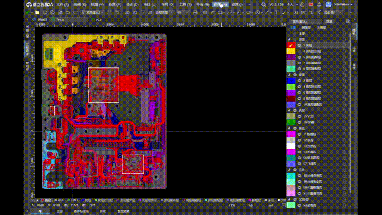

[简体中文](./README.md) | [English](#)

# Balance Copper

EasyEDA Pro extension — Automatically fills blank areas on PCB layers with non-functional copper patterns to balance copper density across layers, improving plating uniformity and manufacturing yield.

## Features

### Supported Pattern Types

| Pattern | Description |
|---------|-------------|
| Circle | Circular dots |
| Square | Square shapes |
| Rectangle | Rectangular shapes |
| Diamond | Rhombus (diagonals = width/height) |
| Oval | Stadium/oblong shape |
| Triangle | Isosceles triangle |
| Pentagon | Regular pentagon |
| Hexagon | Regular hexagon |
| Trapezoid | Isosceles trapezoid (top = bottom/2) |

### Core Capabilities

- **Precise Clearance**: Accurate avoidance for tracks (capsule shape), pads (actual shape + rotation), vias, copper pours, existing fills, and routing slots
- **Footprint-aware**: Parses footprint files to avoid pads (with rotation) and MULTI-layer routing slots (circle/rectangle/arbitrary polygon)
- **DRC Spacing**: Auto-reads DRC rule matrix, applies per-type clearance (track/pad/region/board edge)
- **Stagger**: Optional staggered row offset; layer stagger offsets adjacent layers by half a step
- **Rotation**: Arbitrary rotation angle for all patterns
- **Target Layers**: Current layer / All signal layers / All solder mask layers / Signal + mask
- **Area Generate**: Click two points on the canvas to define a fill region
- **Auto DRC**: Optionally run DRC check after generation completes
- **Expression Input**: Parameter inputs support arithmetic (e.g., `5+3` auto-evaluates to `8`)
- **Unit Adaptive**: Auto-detects current EDA unit (mil/mm/inch) and converts accordingly
- **Bilingual**: Follows EDA language setting (Chinese / English)

### Spacing

The spacing parameter is the **gap between pattern edges**, not center-to-center distance. Actual grid step = pattern size + spacing. Horizontal and vertical spacing can be set independently.

## Installation

1. Download the latest `.eext` file from [Releases](../../releases)
2. In EasyEDA Pro: Extensions → Manage Extensions → Install Local Extension
3. Select the downloaded `.eext` file

## Usage

1. Open a PCB design document
2. Menu bar → Extensions → Balance Copper Tool → Balance Copper...
3. Select pattern type and configure parameters
4. Click "Generate" or "Area by Click"

## License

[Apache License 2.0](https://choosealicense.com/licenses/apache-2.0/)
